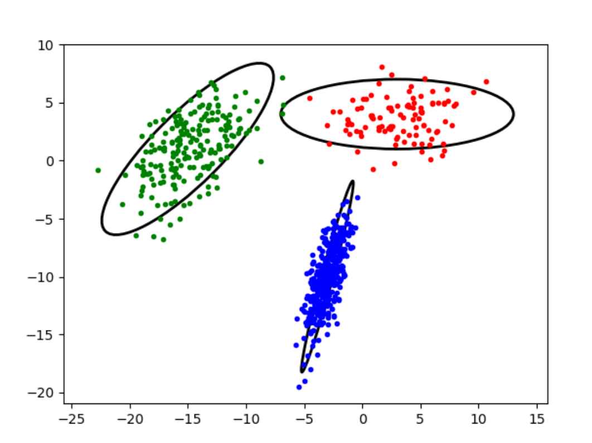

# EMClustering Coding Project
This project will produce a Numpy implementation of EMClustering, along with a data generation tool to support testing the EMClustering implementation.  Learning to use Numpy and PyPlot is a principal goal of this assignment.

## Phase 1 Write a dataset generator
Use the supplied MakeMVClusters.py scaffold, and fill in missing steps to produce a program that generates a pickle file containing a single numpy array of d-dimensional points.  MakeMVClusters reads a JSON formatted file like the
supplied MV1.in, which gives a dimension value, and the mean, sigma, and point 
count for one or more clusters.  You run it thus:

python MakeMVClusters.py <configFile> <pickleOutputFile> [comma-separated options]

If the word "verbose" is one of the options, MakeMVClusters also prints the configuration, a sample of the first 10 points from the pickle file, and a picture of the generated cluster data, using 
PyPlot.  This comprises colored point clouds for each cluster, and also an
ellipse at 2 standard deviation distance from the center point.

Here is a sample run of MakeMVClusters:

The pyplot display: 



And the command and text output (Your values may differ since they're random, but they must not all come from the same cluster):
```
$ python MakeMVClusters.py MV1.in MV1.out verbose
Generating  {'dim': 2, 'clusters': [{'mean': [3, 4], 'sigma': [[10, 0], [0, 3]], 'numPts': 100}, {'mean': [-15, 1], 'sigma': [[6.5, 3.5], [3.5, 6.5]], 'numPts': 200}, {'mean': [-3, -10], 'sigma': [[1, 2], [2, 8]], 'numPts': 400}]}
[[-14.44887245   0.80871476]
 [ -1.70872688  -7.6049518 ]
 [  4.1507679    6.41269918]
 [ -2.32286371 -10.61501481]
 [ -3.3545244  -12.41835679]
 [-12.97114612   6.75887577]
 [ -2.54195976   4.23352316]
 [ -3.38364657  -9.11110374]
 [ -2.27414744 -11.90995098]
 [-15.5385435    2.28277911]]
```

### Submission
Submit by first demoing a style-correct version for me, and then submitting MakeMVClusters.py to the Canvas assignment.

## Phase 2 Write EMClusters.py
In this phase you take the output from MakeMVClusters.py and perform the EMClustering algorithm on it.  Create a program EMClusters.py with commandline thus:
```
python EMClusters.py inFile outFile numClusters <options>
```
where `infile` is an output file from MakeMVClusters, and `<options>` is an optional
comma-delimited string with "verbose" as its one option currently.

EMClusters performs iterations of the EMCluster algorithm, per Algorithm 13.3 in 
our text, stopping when the total mean-change is less than .001.  

### Verbose option
Under the verbose option, EMClusters prints the point set that was read in, and,
at the start of each iteration of the repeat loop, it prints the 0-based loop number, and the $\mu$, $\Sigma$ and P values for all clusters, along with the resultant computed weights for all cluster/point combinations as a 2-D array.

And, if dimensions = 2, it displays a diagram like that for MakeMVClusters, but with all points simply black, and with a colored "o" point and ellipse for each cluster, showing for that step the position and orientation of the cluster.  Pop up a new diagram for each iteration of the loop, so you can watch the cluster configurations converge.

### Use of Numpy
Your program must run quickly by using Numpy.  You may start with more Python loops to get an accurate implementation, but ultimately you may have at most three loops
in the entire program, including the main while-loop driving the iterations.  

Numpy methods you may find useful include uniform, full, repeat, reshape, reciprocal,
sqrt, det, inv, sum, concatenate, dot, matmul, multiply, subtract and others.  When possible, use these as methods of ndarray, preferably in operator form (e.g "-" instead of "subtract")

### Submission
Submit by first demoing a style-correct version for me, and then submitting EMClusters.py to the Canvas assignment.