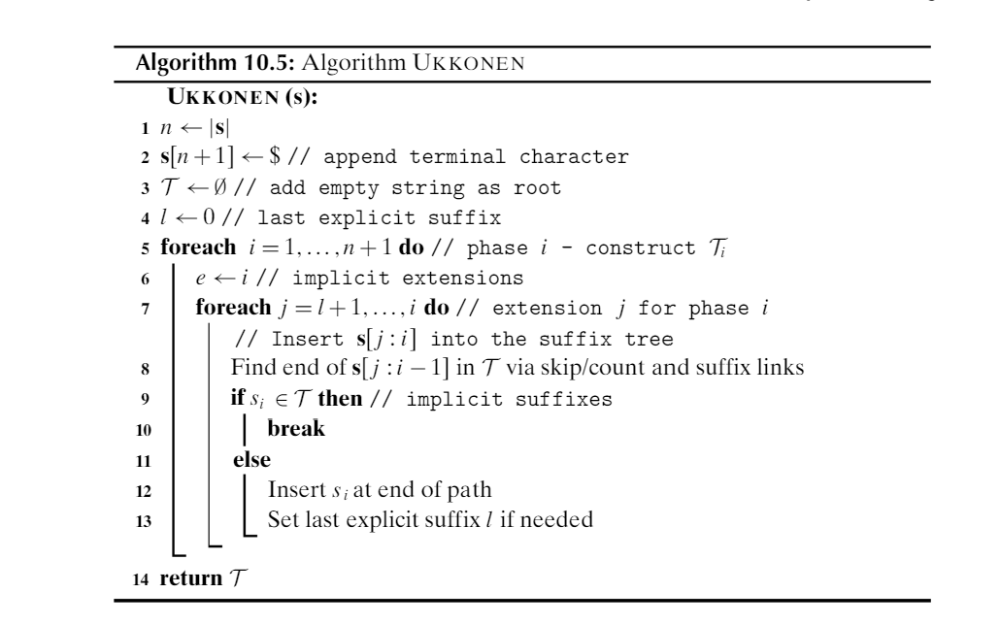

# Data Science Midterm
<div style="text-align: right">Name ________________________________________</div>

**1. 34 pts Vocabulary**\
Give correctly-spelled terms to match the following definitions.

Itemset for which the addition of any item will result in decrease of support 


Itemset for which the removal of any item will result in increase of support\


Ratio of the joint likelihood of two events to the product of their independent likelihoods

Ratio of likelihood of $X\rightarrow Y$ to likelihood of X alone\

Optimization method that mimics a ball rolling down hill on a cost surface. 


Fraction of correct predictions made by a classifier, on average 

An association rule for which removal of any antecedent item results in loss of confidence 

A tree structure that improves on a trie by labelling branches by strings, not just characters 

Bayes classifier that assumes statistical independence of all attributes 

Measure of average number of "symbols" needed to transmit a result from a probability distribution 

A common name for L-1 norm

Measure of the **extra** bits of entropy incurred when transmitting PDf p using
the optimal encoding for a different PDF q.  

Subsequence-finding algorithm that tracks the final positions of a subseqence

Itemset finding algorithm that is most similar in design to the PrefixSpan algorithm

Tree structure that reflects a partial ordering

Number of different rules that can be derived from an itemset of 12 items

Modification of Eclat/Declat that produces only closed itemsets

**2. 62pts Data Science Math**

**a. 8pts** The angle in radians between vectors [2, 4, 1, 2] and [4, 2, 2, 1]\


**b. 10pts** The vector projection of the second vector onto the first in the prior question


**c. 14pts** Write a matrix representing a $\frac{\tau}{8}$ or $45\degree$ clockwise rotation around the X axis (Z and Y axis both move toward you)\
```


```

**d. 12pts** Three models of cars are shown below, each with a popularity and a likelihood of being in the shop for repairs.  If a car is in the shop, what is the chance it's a model X?

|Model|Popularity|Repair frequency|
|---|---|---|
|X|50%|2%|
|Y|30%|4%|
|Z|20%|5%|
```


```

**e 10pts** Describe the shape of the points at exactly 2 standard deviation distance from the center of a multivariate normal with $\Sigma = \begin{bmatrix}9&&0&&0\\0&&9&&0\\0&&0&&9\end{bmatrix}$ and $\mu = \begin{bmatrix}0&&6&&0\end{bmatrix}$  Is the origin one of the points in this shape? Why or why not?
```


```

**f 8pts** Assume a probability distribution with 4 possible events, all with probability of at least .01.  What distribution will have the lowest entropy?  What entropy will that be, exactly?  (You may give base-10 entropy if you like; it's easier to do on a typical calculator.)
```


```
**3. 34 pts Charm Algorithm**\
Below is a snapshot of Charm from the text.

First, construct a 4 transaction (labelled (0-4), 3 item (labelled A-C) database that generates 7 separate closed itemsets assuming a minsup of 1.  Show the database.

Then examine how Charm works on that database.  Show the final contents of 
variable $C$ in the Charm code, and explain how many times lines 9, 13, and 15 
will be executed during the Charm run.


```


```
**4. 50pts Naive Bayes Classification**\
The following table of data for Titanic survivors gives age and cabin type for 6 people (the attributes), along with a Y/N value for survival (the class).  Based on this, build a naive Bayesian model that predicts survival based on age and cabin type.  Treat age as a numerical attribute, but cabin type as a categorical. Note this means a pseudocount in this attribute for one class (though not the other) and thus denominators of 6 and 5 in the categorical probabilities.

Compute the likelihood of survival and nonsurvival
for a 30 year old in a first-class cabin under your model.  Show your work,
following the provided structure.  Use $\mathcal{N}(\mu, \sigma^2)$ notation for
any normal distributions you arrive at, and use the PDF equation $\frac{1}{\sqrt{\tau\sigma^2}}e^{-\frac{(x-\mu)^2}{2\sigma^2}}$, not a cumulative normal table.  As a hint, the correct value for that person's survival is between .1 and .2. 

age|cabin|survived
---|---|---
5|first|Y
25|first|N
40|first|N
15|second|N
30|second|N
10|third|Y
15|third|N
30|third|Y

## Conditional probabilities for survival = Y (14 pts)
### Age
```


```

### Cabin
```


```

## Conditional probabilities for survive = N (12 pts)
### Age
```


```

### Cabin
```


```

## Overall Class probabilities (4 pts)
```

```

## P(Y|first, age=20)  (20pts)

```


```
**6. 56pts Ukkonen's Algorithm**
Below is a snapshot of Ukkonen's algorithm from the text.  Answer the following questions, tying the visual steps of the algorithm as displayed in our favorite simulation to the lines of the code, which you may run to help you answer this
if you like.



**a. 8pts** How many nodes in the suffix tree, and which ones, might be modified by line 6?
```

```
**b. 8pts** If your answer to a is not a fixed or limited number, then given that line 6 is inside an O(n) loop, this suggests the algorithm has complexity worse than O(n).  How do you reconcile this with the known O(n) complexity of Ukkonen's?
```

```

**c. 8pts** Which line performs the "move the pipe forward" step that we see in the Ukkonen's simulation?
```

```

**d. 8pts** On what line would we add a suffix link?

```

```

**e. 8pts** The simulation tracks a "remainder" variable.  Write an expression, using the variables of the algorithm pseudocode, that is equivalent to "remainder".


**f. 8pts** Line 8 looks like a bit of a hunt in the tree.  How does the depth of the tree affect the amount of time line 8 will take?  Why?
```

```

**g. 8pts** If n = 100, what is the maximum number of times line 10 might execute?  Lines 12-13?  Why?

```


```

**7.56pts EM Algorithm**\
Below is a snapshot of the EM algorithm from the text.  Answer the following questions regarding it.


**a. 16pts** What range of possible values might these two summations have? Explain your answer for each.

$\sum_{i=1}^{i=k}w_{ij}$  (for various values of j)

```

```

$\sum_{j=1}^{j=n}w_{ij}$  (for various values of i)


```

```

**b. 8pts** Give an intuitive description of the meaning of $\sum_{j=1}^{j=n}w_{ij}$ in the algorithm.  (Don't just recite the math.)
```

```
**c. 8pts** On line 11, what is the dimension of $\Sigma$?  Use variables from the algorithm if possible, or if you make up new ones explain their meaning in terms of variables in the algorithm.


**d. 8pts** How is the $\Sigma$ dimension you gave in part c obtained from what appears to be a summation of dot products?  And, how can we be sure $\Sigma$ is positive definite, or at least symmetrical?

```

```

**e. 8pts** What is the order of complexity of *one* iteration of the repeat loop?  You may create one new variable for this, but otherwise use only variables in the code.  Explain your answer.

```


```

**f. 8pts** For this algorithm, how do you think worst-case, average-case, and best-case complexities for one loop-iteration relate? Why?
```

```