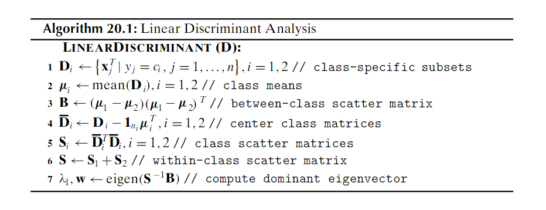
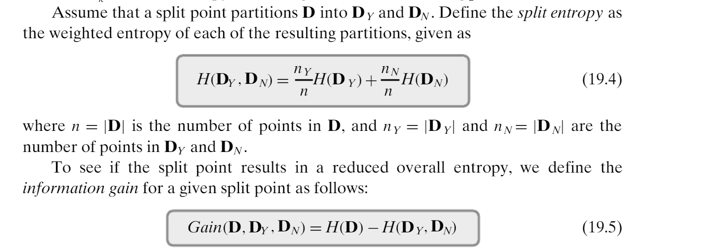

# Data Science Midterm 2
<div style="text-align: right">Name ________________________________________</div>

**1. 34 pts Vocabulary**\
Give correctly-spelled terms to match the following definitions.

Three alliterative terms describing how "big data" differs from ordinary data

Prefix meaning $10^{21}$

Itemset for which the addition of any item will result in decrease of support

In PCA, the role of the eigenvector with largest eigenvalue

Metric using ratio of the joint likelihood of two events to the product of their independent likelihoods

Optimization method that mimics a ball rolling down hill on a cost surface.

Probability distribution that underlies a Fisher test

Fraction of correct predictions made by a classifier, on average

An association rule for which removal of any antecedent item results in loss of confidence

A tree structure that improves on a trie by labelling branches by strings, not just characters

Bayes classifier that assumes statistical independence of all attributes

Measure of average number of "symbols" needed to transmit a result from a probability distribution

Measure of the decrease in entropy resulting from dividing categorized points into two groups

Type of error that results in a rightward jump in an ROC curve

Type of error that results in an upward jump in an ROC curve


**2. 28 pts Data Science Math**

**a. 8pts** The angle in radians between vectors [1, 2, 2] and [2, 1, 2]
**.475 R**

**b. 10pts** The vector projection of the second vector onto the first in the prior question
**[1, 2, 2]*(8/9) = [8/9, 16/9, 16/9]**

**c. 10pts** Write a matrix representing a $\frac{\pi}{2}$ or $90\degree$ clockwise rotation around the Z axis (X and Y axis both turn clockwise) 

$\begin{bmatrix}0&&1&&0\\-1&&0&&0\\0&&0&&1\end{bmatrix}$

**3. 30 pts Charm Algorithm**\
Below is a snapshot of Charm from the text.  Construct a 4 transaction, 3 item database that generates 7 separate closed itemsets assuming a minsup of 0.  Show the database, the final contents of $C$, and explain how many times lines 9, 13, and 15 will be executed during the Charm run.


```
A         B       3
123       234     124   (or equiv)

AB    AC         BC
23    12         24

ABC
2

Line 9 0 times;  line 13 0 times;  line 15 4 times.
```
**4. 20 pts Linear Discriminant**\
The linear discriminant algorithm, repeated below, fails when there are only two points per class.  Explain exactly what the failure will be (including the line of code that will fail), and exactly why it always occurs in the case of 2 points per class.



```
1. 4pts Just two points results in collinear mean and points
2. 10pts Collinear pair of vectors results in identical S matrices and thus singular
3. 6pts Singular is not invertible
```

**5. 20 pts ROC Metric**\
Draw the ROC curve for the following data, and determine the ROC value (area above the x axis).  
Note that the data are sorted, but not necessarily in exactly the right way.
P/N indicates whether the sample was actually positive or negative.  

What effect would adding .05 to each threshold value have on the ROC value?

|.1|.24|.25|.25|.25|.92|
|---|---|---|---|---|---|
|-1|+1|-1|+1|+1|+1|

```

(0,0) -> (0, .25) -> (.75, .5) -> (1, .5) -> (1, 1)


ROC = .5*..75 + .5 = .875

```
**6. 70pts PCA**\
Below is an implementation of PCA that determines first principal component, and projects all points onto that component, as projected vectors (not just scalars).  It has 4 omissions and 5 bugs.  Fix these
so that the output is as shown.  Then, show how to adjust the initial vector in the doPCA call so that the new variance is equal to the total variance, making only modest changes to the five points in the vector.
``` 
import numpy as np

def doPCA(d):
   numPts = len(d)
   mean = d.mean()  **axis = 0**
   dBar = d - mean
   sigmas = np.matmul(dBar.reshape(numPts, 1, 2), dBar.reshape(numPts, 1, 2))  **2, 1**
   sigma = sigmas.sum()  **axis = 0** **numPts**
   eVals, eVecs = np.linalg.eigh(sigma)
   totalVar = sigma.________()  **trace**

   print(f"Dbar: {dBar}\nSigma:\n{sigma}\nEVals: {eVals}\nEVecs:\n{eVecs}\n")
   print(f"Reducing variance to {____________} from {totalVar}") **eVars[-1]**

   return np.dot(dBar, ________).reshape(numPts, 1)*eVecs[-1] _________  **eVecs[-1]** **+ mean**

def main():
   prjD = doPCA(np.array([[8, -20], [0, -1], [10, -19], [10, -20], [2, 0]]))
   print(f"Projected: {prjD}")

main()
-----------------
Correct Output:
Dbar: [[ 2. -8.]
 [-6. 11.]
 [ 4. -7.]
 [ 4. -8.]
 [-4. 12.]]
Sigma:
[[ 17.6 -38. ]
 [-38.   88.4]]
EVals: [  1.06581088 104.93418912]
EVecs:
[[-0.91696017 -0.39897876]
 [-0.39897876  0.91696017]]

Reducing variance by 104.93418912431386 from 106.0
Projected: [[  9.24514914 -19.45822286]
 [  1.02057177  -0.55593877]
 [  9.19766961 -19.34910217]
 [  9.56351724 -20.18991812]
 [  0.97309224  -0.44681808]]

 8pts  Adjust by replacing original vector with the projected values.
```


**7. 40 pts Naive Bayes Classification**\
The following table of data for Titanic survivors gives age and cabin type for 6 people,
along with a Y/N value for survival.  Based on this, build a naive Bayesian model
that predicts survival based on age and cabin type.  (Note this means a 
pseudocount for one class and thus denominators of 6 and 3 in the 
categorical probabilities.) Compute the likelihood of survival and nonsurvival
for a 20 year old in a first-class cabin under your model.  Show your work.

age|cabin|survived
---|---|---
5|first|Y
40|first|N
20|second|N
10|third|Y
15|third|N
30|third|Y

## Survive = Y (8 pts)
### Age
$\mu = \frac{5+10+30}{3}=15$
$\sigma = \sqrt{\frac{10^2+5^2+15^2}{3}}=10.08$

### Cabin
P(F|Y) = 1/3
P(S|Y) = 1/6
P(T|Y) = 1/2

## Survive = N (8 pts)
### Age
$\mu = \frac{20+15+40}{3}=25$
$\sigma = \sqrt{\frac{5^2+10^2+15^2}{2}}=10.08$

### Cabin
P(F|N) = 1/3
P(S|N) = 1/3
P(T|N) = 1/3

## Overall (2 pts)
P(Y) = 1/2, P(N) = 1/2

## P(Y|first, age=20)  (10pts)

P(Y|F, age=20)
= $\frac{f_y(20)(.333)(.5)}{f_y(20)(.333)(.5)+f_n(20)(.333)(.5)}$
= $\frac{(.0357)(.333)(.5)}{(.00049))(.0357)(.6)+(.0357)(.333)(.5)}$
= .5$


**8. 30pts Decision Trees**\
Using the same data as for the Titanic example above, construct a decision tree with 100% purity on each leaf.  Make decision branches based on maximum gain.  You should end up with three branching nodes, and four leaves.
State the initial entropy, and the gain made by each decision.  Recall the following definition for gain:



```
Initial entropy = 1
First cut: age < 12, gain = .47
Second cut: age < 25 or cabin = third, gain .81 - .5 = .31
Third cut: other choice of second, or age < 35  gain = .5 - 0 = .5


```
