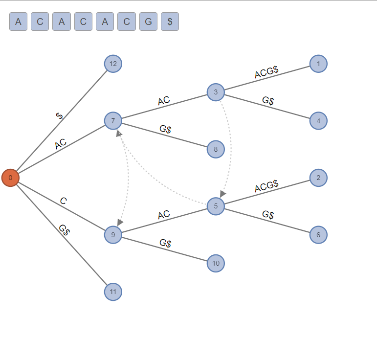
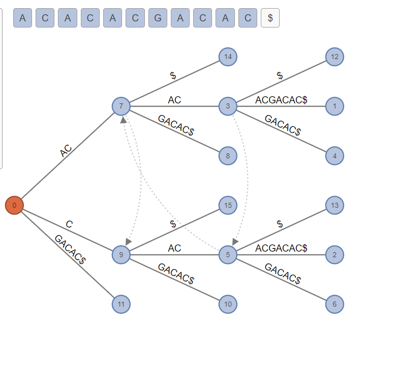

# Ukkonen Quiz

Name ________________________________________

1. 20pts 
Develop the Ukkonen tree for the following string, showing nodes, links and suffix-links.  You should end up with 13 nodes counting the root, and 3 suffix links.

A C A C A C G

2. 10 pts (Extra Credit) Extend the string above by as few letters as possible, so that all three of the suffix links you built in part 1 will actually be used. Show the larger tree that will result.  It should have only three more nodes.

